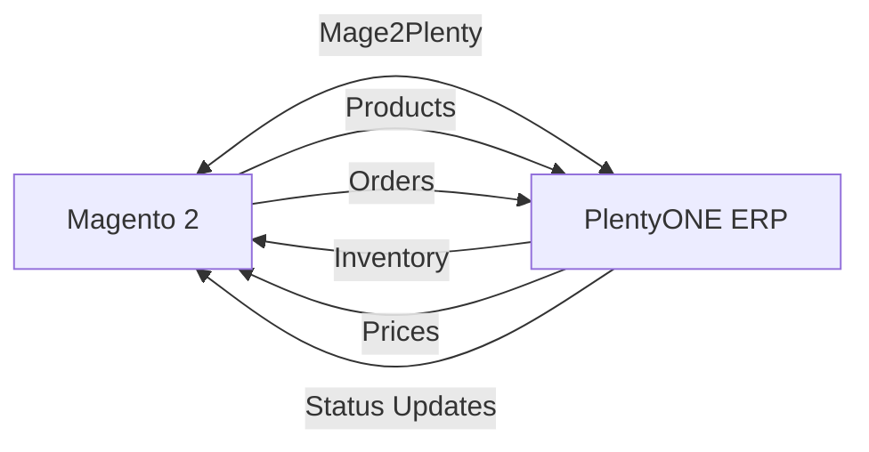

# Getting Started with Mage2Plenty

Welcome to **Mage2Plenty** - the enterprise-grade connector that seamlessly integrates your Magento 2 e-commerce platform with PlentyONE ERP system.

:::info Byte8 (former SoftCommerce)
Mage2Plenty is now developed and maintained by **Byte8** — the same team you previously knew as **SoftCommerce**. The product is unchanged; only the company name, composer vendor (`byte8/*`), and PHP namespace (`Byte8\…`) have been rebranded. See the [migration notes](/docs/installation/upgrade-new-connector) if you're upgrading from a SoftCommerce-vendored release.
:::

:::danger Upgrading from v3.x to v4.0.0? Important Information
**Mage2Plenty v4.0.0 is a major release — the SoftCommerce → Byte8 rebrand — with breaking changes.**

If you're upgrading from a v3.x (SoftCommerce-vendored) release, please read the [migration guide](/docs/installation/upgrade-new-connector) before updating. This release renames the Composer vendor and PHP namespace, so it requires manual `composer.json` changes.

**Key Changes:**
- Composer vendor renamed: `softcommerce/*` → `byte8/*` (require `byte8/magento-plentyone-suite` and remove the old `softcommerce/*` packages)
- PHP namespace renamed: `SoftCommerce\…` → `Byte8\…`
- Admin menu and configuration moved from **SoftCommerce** to **Byte8**
- Further module consolidation (fewer, larger modules)

**⚠️ Required after upgrading — re-collect client configuration data**

After the upgrade your profiles will **not** have client configuration data — web stores, warehouses, prices, VAT rates, referrers, and payment/shipping methods. You **must** re-collect it before running any profile, otherwise syncs will fail or produce incomplete data.

Run it via **CLI**:

```bash
bin/magento plenty:setup:collect:config
```

Or via the **Admin UI**: **Stores → Configuration → Byte8 → PlentyONE Integration → Authentication Settings → Actions → Run Setup Wizard**.

[Read the full migration guide →](/docs/installation/upgrade-new-connector)
:::

## What is Mage2Plenty?

Mage2Plenty is a powerful, bi-directional integration solution that automates critical business processes between Magento 2 and PlentyONE. It eliminates manual data entry, reduces errors, and ensures data consistency across both platforms.

### Key Features

- 📦 **Product Synchronization** - Sync products, categories, attributes, and media
- 📊 **Inventory Management** - Real-time stock updates with MSI support
- 🛒 **Order Processing** - Automated order export and status updates
- 👥 **Customer Sync** - Keep customer data synchronized across platforms
- ⚙️ **Flexible Configuration** - Comprehensive admin panel for mappings and rules
- 🚀 **Enterprise Ready** - Built for scale with multi-store support

## What You'll Need

Before you begin, make sure you have:

1. **Mage2Plenty License** - [Purchase the extension](https://mage2plenty.com/magento2-plentymarkets-connector/) for your Magento edition
2. **[System Requirements](/docs/system-requirements)** - Check if your environment meets all requirements
3. **PlentyONE Account** - Active PlentyONE account with API access
4. **Magento 2.4.4+** - Compatible Magento installation
5. **Composer** - For installing the extension

## Quick Start

Follow these steps to get Mage2Plenty up and running. **Complete all 7 steps** for a successful integration.

### Step 1: Check System Requirements

First, verify your system meets all [requirements](/docs/system-requirements):

- Magento 2.4.4 or higher
- PHP 8.1 or higher
- MySQL 8.0 or MariaDB 10.6
- Required PHP extensions (including curl, json, openssl, xml, zip, mbstring)

### Step 2: Install Mage2Plenty Connector

#### Setup Composer Repository

After purchasing the extension, you'll receive access to a private Composer repository:

```bash
# Add the private repository
composer config repositories.private-packagist composer https://byte8.packages.cargoman.io

# Setup authentication (use token as username)
composer config --global --auth http-basic.byte8.packages.cargoman.io token your-access-token
```

#### Install the Package

For **Magento Open Source**:
```bash
composer require byte8/magento-plentyone-suite
```

For **Adobe Commerce**:
```bash
composer require byte8/magento-plentyone-suite-ac
```

#### Complete Installation

```bash
bin/magento setup:upgrade
bin/magento setup:di:compile
bin/magento setup:static-content:deploy
bin/magento cache:flush
```

For detailed installation instructions, see:
- [Composer Installation Guide](/docs/installation/composer-installation) - For direct purchases
- [Marketplace Installation Guide](/docs/installation/marketplace-composer-installation) - For Magento Marketplace purchases

### Step 3: Configure Client Connection

Configure your PlentyONE API connection using the interactive setup wizard:

```bash
bin/magento plenty:setup:client
```

This wizard will guide you through:
- PlentyONE API credentials (URL, Client ID, username, password)
- Core system settings (logging, mail notifications)
- REST API connection parameters
- Automatic connection testing

Or configure manually via admin panel at **Byte8 → PlentyONE → Manage Client Connection**

### Step 4: Configure Profile System & Notifications

Set up profile execution settings and notification system:

```bash
bin/magento plenty:setup:profile:system
```

This configures:
- Profile history retention
- Notification settings and log levels
- Email alerts for critical errors
- Batch notification intervals
- Performance settings

### Step 5: Collect Configuration Data from PlentyONE

Collect essential configuration data (referrers, shipping methods, VAT rates, etc.):

```bash
bin/magento plenty:setup:collect:config
```

This retrieves system configuration from PlentyONE including:
- Referrers and order referrers
- Shipping profiles and methods
- VAT configurations
- Payment methods
- Warehouses and stock sources

### Step 6: Create System Attributes in PlentyONE

Create required system properties and attributes in PlentyONE:

```bash
bin/magento plenty:setup:create
```

This creates:
- Default referrer and media type referrers
- Customer properties
- Item properties (attribute sets, property groups)
- Order properties

:::tip Quick Setup
**Steps 5 and 6 can be run together** using the orchestrator command:

```bash
bin/magento plenty:setup:init
```

This automatically executes both `plenty:setup:collect:config` and `plenty:setup:create` in the correct order.

Options:
- `--modules=referrer,customer,item,order` - Setup specific modules only
- `--skip-collect` - Only create properties (skip collection)
- `--skip-create` - Only collect config (skip creation)
- `--dry-run` - Preview what will be done
:::

### Step 7: Collect Initial Data from PlentyONE

Collect business data from PlentyONE (attributes, properties, categories, etc.):

```bash
bin/magento plenty:setup:collect:data
```

This collects:
- Attributes and attribute sets
- Properties and property groups
- Categories and category structures
- Product data (optional)
- Customer data (optional)

:::info
After collecting data, you can map and configure it in the Magento Admin panel under **Byte8 → PlentyONE**.
:::

### Verification Steps

After completing the setup, verify everything is working:

```bash
# Run system check
bin/magento plenty:system:check

# Test PlentyONE connection
bin/magento plenty:client:test

# Flush cache
bin/magento cache:flush
```

## What's Next?

Now that setup is complete, configure your integration profiles:

- 📖 **[Setup Auto-Configuration](/docs/profiles/setup-auto-config)** - Automatically configure profiles
- 🔧 **[Product Import Profile](/docs/profiles/product-import)** - Configure product synchronization
- 📦 **[Order Export Profile](/docs/profiles/order-export)** - Setup order processing
- 📊 **[Stock Import Profile](/docs/profiles/stock-import)** - Configure inventory sync
- 👥 **[Customer Sync](/docs/profiles/customer-import)** - Setup customer synchronization
- 📚 **[All Profiles](/docs/profiles/about-profiles)** - Explore all available profiles

## Need Help?

- 📧 **Email Support**: support@byte8.io
- 📞 **Phone**: +44 2080 587 795 (GMT working hours)
- 🐛 **Bug Reports**: [GitHub Issues](https://github.com/byte8/mage2plenty/issues)
- 📖 **Documentation**: Browse this site for comprehensive guides

## Video Tutorial

:::warning Outdated Content
This video shows a previous version of the setup process. While the core configuration concepts and form fields remain similar, **the setup wizard interface and workflow have changed**. Follow the written documentation above for current instructions.

**What's Still Relevant:**
- ✅ Configuration form fields and their purposes
- ✅ PlentyONE credential requirements
- ✅ Connection testing concepts
- ✅ General setup workflow

**What's Changed:**
- ❌ New CLI wizards available (`bin/magento plenty:setup:client` and `bin/magento plenty:setup:profile:system`)
- ❌ Updated admin menu paths (now **Byte8 → PlentyONE**)
- ❌ Enhanced connection testing and validation
- ❌ Automated token management
:::

<div style={{position: 'relative', paddingBottom: '56.25%', height: 0}}>
  <iframe
    style={{position: 'absolute', top: 0, left: 0, width: '100%', height: '100%'}}
    src="https://www.youtube.com/embed/vhurmQVNPQQ"
    title="Mage2Plenty Connection Configuration"
    frameBorder="0"
    allow="accelerometer; autoplay; clipboard-write; encrypted-media; gyroscope; picture-in-picture"
    allowFullScreen
  />
</div>

:::tip Pro Tip
Enable RabbitMQ for asynchronous profile processing to significantly improve performance, especially for large catalogs.
:::

## Architecture Overview



Understanding this bi-directional architecture helps you configure the integration effectively.
