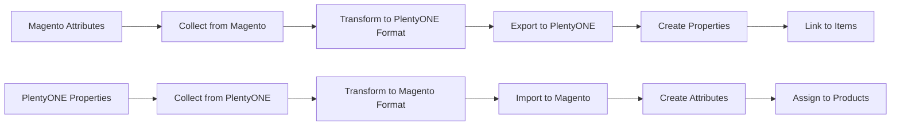

# Attribute & Property Mapping

Attribute and property mapping is essential for synchronizing product data between Magento and PlentyONE. This guide explains how to configure mappings and handle various attribute types.

## Understanding the Difference

### Magento Attributes

**Attributes** in Magento define product characteristics:
- Product attributes (name, description, SKU, price)
- Custom attributes (brand, material, size, color)
- System attributes (status, visibility, weight)

**Attribute Types:**
- Text (text field, textarea)
- Select (dropdown, multi-select)
- Boolean (yes/no)
- Date
- Price
- Media (image, gallery)

### PlentyONE Properties

**Properties** in PlentyONE serve similar purposes but with different structure:
- Item properties (characteristics)
- Property groups (organization)
- Property selections (predefined values)
- Property relations (linking)

## Property Synchronization Workflow



## Initial Property Setup

### Step 1: Collect Attribute Configuration

```bash
# Collect all Magento attributes
bin/magento plenty:attribute:collect --verbose

# Output:
# ✓ Collected 45 product attributes
# ✓ Collected 12 attribute sets
# ✓ Stored in softcommerce_plenty_attribute table
```

**What gets collected:**
- Attribute codes
- Attribute labels (all store views)
- Attribute types
- Frontend input types
- Backend types
- Source models (for select attributes)
- Attribute options and values

### Step 2: Export to PlentyONE

```bash
# Export attributes to create properties in PlentyONE
bin/magento plenty:attribute:export --verbose

# Output:
# Processing attribute: brand
# ✓ Created property: brand (ID: 100)
# Processing attribute: material
# ✓ Created property: material (ID: 101)
# ...
# ✓ Exported 45 attributes
```

### Step 3: Import Properties from PlentyONE

```bash
# Collect properties from PlentyONE
bin/magento plenty:property:collect --verbose

# Import properties to create attributes in Magento
bin/magento plenty:property:import --verbose
```

## Attribute Mapping Configuration

### Configure Mapping in Profile

1. Navigate to **SoftCommerce → Profiles → Manage Profiles**
2. Select your **Item Import** or **Item Export** profile
3. Go to **Configuration → Attribute Mapping**

### Mapping Structure

```json
{
  "attribute_mapping": {
    "name": {
      "plenty_property": "texts.name",
      "direction": "bidirectional"
    },
    "description": {
      "plenty_property": "texts.description",
      "direction": "bidirectional"
    },
    "short_description": {
      "plenty_property": "texts.shortDescription",
      "direction": "bidirectional"
    },
    "brand": {
      "plenty_property": "properties.brand",
      "plenty_property_id": 100,
      "direction": "export"
    },
    "color": {
      "plenty_property": "properties.color",
      "plenty_property_id": 101,
      "direction": "bidirectional"
    }
  }
}
```

### Mapping Directions

| Direction | Description | Use Case |
|-----------|-------------|----------|
| **bidirectional** | Sync both ways | Product name, description |
| **export** | Magento → PlentyONE only | Magento-specific attributes |
| **import** | PlentyONE → Magento only | PlentyONE-specific properties |
| **none** | No synchronization | Excluded attributes |

## Common Attribute Mappings

### Basic Product Information

| Magento Attribute | PlentyONE Property | Notes |
|-------------------|---------------------|-------|
| `name` | `texts.name` | Required, bidirectional |
| `description` | `texts.description` | HTML content |
| `short_description` | `texts.shortDescription` | Plain text recommended |
| `sku` | `variations.number` | Unique identifier |
| `price` | `variations.prices` | Handled separately |
| `weight` | `variations.weightG` | Convert to grams |
| `status` | `isActive` | Boolean mapping |

### Custom Attributes

Configure via profile configuration:

```php
'custom_attribute_mapping' => [
    'brand' => [
        'plenty_property_id' => 100,
        'plenty_property_type' => 'selection',
        'transform' => 'mapBrandValue'
    ],
    'material' => [
        'plenty_property_id' => 101,
        'plenty_property_type' => 'text',
        'transform' => null
    ],
    'color' => [
        'plenty_property_id' => 102,
        'plenty_property_type' => 'selection',
        'transform' => 'mapColorValue'
    ],
    'size' => [
        'plenty_property_id' => 103,
        'plenty_property_type' => 'selection',
        'transform' => 'mapSizeValue'
    ]
]
```

### Media Attributes

| Magento | PlentyONE | Referrer |
|---------|-----------|----------|
| `image` | `images[]` | `magento_image` |
| `small_image` | `images[]` | `magento_small_image` |
| `thumbnail` | `images[]` | `magento_thumbnail` |
| `swatch_image` | `images[]` | `magento_swatch_image` |
| `gallery` | `images[]` | `magento_gallery` |

## Attribute Type Mapping

### Text Attributes

**Magento:**
```php
$product->setData('custom_text', 'Some value');
```

**PlentyONE Property:**
```json
{
  "property": {
    "id": 100,
    "propertyType": "text",
    "value": "Some value"
  }
}
```

**Configuration:**
```php
'custom_text' => [
    'plenty_property_id' => 100,
    'plenty_property_type' => 'text'
]
```

### Select (Dropdown) Attributes

**Magento:**
```php
// Attribute with options
$attribute = $product->getResource()->getAttribute('brand');
$optionId = $product->getData('brand'); // e.g., 42
$optionText = $attribute->getSource()->getOptionText($optionId); // e.g., "Nike"
```

**PlentyONE Property:**
```json
{
  "property": {
    "id": 100,
    "propertyType": "selection",
    "propertySelection": {
      "id": 5,
      "name": "Nike"
    }
  }
}
```

**Configuration:**
```php
'brand' => [
    'plenty_property_id' => 100,
    'plenty_property_type' => 'selection',
    'value_mapping' => [
        42 => 5,  // Magento option ID => PlentyONE selection ID
        43 => 6,  // "Adidas"
        44 => 7   // "Puma"
    ]
]
```

### Multi-Select Attributes

**Magento:**
```php
$product->setData('categories', '10,20,30'); // Comma-separated
```

**PlentyONE:**
```json
{
  "properties": [
    {"propertyId": 100, "propertySelectionId": 10},
    {"propertyId": 100, "propertySelectionId": 20},
    {"propertyId": 100, "propertySelectionId": 30}
  ]
}
```

**Configuration:**
```php
'categories' => [
    'plenty_property_id' => 100,
    'plenty_property_type' => 'multi_selection',
    'split_character' => ','
]
```

### Boolean (Yes/No) Attributes

**Magento:**
```php
$product->setData('is_featured', 1); // 1 or 0
```

**PlentyONE:**
```json
{
  "property": {
    "id": 100,
    "propertyType": "text",
    "value": "true"  // or "false"
  }
}
```

**Configuration:**
```php
'is_featured' => [
    'plenty_property_id' => 100,
    'plenty_property_type' => 'text',
    'transform' => 'booleanToString',
    'value_mapping' => [
        1 => 'true',
        0 => 'false'
    ]
]
```

### Date Attributes

**Magento:**
```php
$product->setData('release_date', '2025-01-13'); // Y-m-d format
```

**PlentyONE:**
```json
{
  "property": {
    "id": 100,
    "propertyType": "date",
    "value": "2025-01-13T00:00:00+00:00"  // ISO 8601
  }
}
```

**Configuration:**
```php
'release_date' => [
    'plenty_property_id' => 100,
    'plenty_property_type' => 'date',
    'transform' => 'dateToIso8601'
]
```

## Property Groups

### Create Property Groups

Property groups organize related properties in PlentyONE:

```bash
# Export attribute sets as property groups
bin/magento plenty:attribute:export-groups --verbose

# Output:
# Processing attribute set: Default
# ✓ Created property group: Magento Default (ID: 10)
# Processing attribute set: Clothing
# ✓ Created property group: Magento Clothing (ID: 11)
```

### Configure Group Mapping

```php
'property_group_mapping' => [
    4 => 10,   // Magento attribute set ID => PlentyONE property group ID
    9 => 11,   // "Default" => "Magento Default"
    10 => 12   // "Clothing" => "Magento Clothing"
]
```

## Advanced Mapping Scenarios

### Conditional Mapping

Map attributes based on conditions:

```php
'conditional_mapping' => [
    'special_price' => [
        'condition' => 'hasSpecialPrice',
        'plenty_property_id' => 200,
        'fallback' => 'price'
    ]
]
```

### Composite Attributes

Combine multiple Magento attributes into one PlentyONE property:

```php
'composite_mapping' => [
    'full_description' => [
        'plenty_property_id' => 105,
        'combine' => ['description', 'additional_info'],
        'separator' => "\n\n"
    ]
]
```

### Calculated Attributes

Generate property values from calculations:

```php
'calculated_mapping' => [
    'price_per_unit' => [
        'plenty_property_id' => 106,
        'calculation' => 'dividePrice',
        'params' => ['price', 'qty']
    ]
]
```

### Locale-Specific Mapping

Map attributes per store view/locale:

```php
'locale_mapping' => [
    'name' => [
        'plenty_property' => 'texts.name',
        'locales' => [
            'en_US' => 'lang=en',
            'de_DE' => 'lang=de',
            'fr_FR' => 'lang=fr'
        ]
    ]
]
```

## Testing Attribute Mapping

### Test Single Product

```bash
# Export single product with verbose output
bin/magento plenty:item:export --sku=TEST-SKU --verbose

# Check logs for attribute mapping
tail -f var/log/plenty_item.log | grep "attribute"

# Verify in PlentyONE backend
# Items → Item Overview → Search TEST-SKU → Properties tab
```

### Verify Mapping

```bash
# Check attribute entity table
mysql> SELECT * FROM plenty_attribute_entity WHERE attribute_code = 'size';

# Check property mapping
mysql> SELECT * FROM plenty_property_entity WHERE property_code = 'custom_atttribute';

# View collected attributes
mysql> SELECT entity_id, attribute_code, status FROM plenty_attribute_entity;
```

### Validate Property Values

```sql
-- Check exported property values
SELECT
    p.sku,
    a.attribute_code,
    pv.value as magento_value,
    pa.plenty_property_id
FROM catalog_product_entity p
JOIN catalog_product_entity_varchar pv ON p.entity_id = pv.entity_id
JOIN eav_attribute a ON pv.attribute_id = a.attribute_id
JOIN softcommerce_plenty_attribute pa ON a.attribute_id = pa.magento_attribute_id
WHERE p.sku = 'TEST-SKU'
AND pa.sync_direction IN ('export', 'bidirectional');
```

## Troubleshooting Mapping Issues

### Issue: Attribute Not Syncing

**Check:**
1. Attribute is in mapping configuration
2. Sync direction is correct
3. Property ID is valid
4. Attribute has value

```bash
# Debug single attribute
bin/magento plenty:attribute:export --attribute=brand --verbose
```

### Issue: Wrong Value Synced

**Check:**
1. Value mapping configuration
2. Data transformation functions
3. Type compatibility

```bash
# View raw attribute value
mysql> SELECT value FROM catalog_product_entity_int WHERE entity_id = 123 AND attribute_id = 100;

# View mapped property value in PlentyONE
# Items → Item → Properties
```

### Issue: Property Not Created

**Possible causes:**
- Property already exists with different configuration
- Insufficient API permissions
- Invalid property type

**Solution:**
```bash
# Check existing properties
bin/magento plenty:property:collect --verbose

# View collected properties with selection type
mysql> SELECT
    ppe.entity_id as property_id,
    ppe.property_code,
    ppe.property_type,
    ppe.attribute_code,
    pps.entity_id as selection_id,
    pps.position as selection_position,
    ppsv.lang,
    ppsv.value as selection_value
FROM plenty_property_entity ppe
LEFT JOIN plenty_property_selection pps ON pps.parent_id = ppe.entity_id
LEFT JOIN plenty_property_selection_value ppsv ON ppsv.parent_id = pps.entity_id
WHERE ppe.property_type = 'selection'
ORDER BY ppe.entity_id, pps.position;

# Manually create property if needed via PlentyONE backend
# Setup → Item → Properties
```

## Best Practices

1. **Plan Mapping Before Export:**
   - Document all attributes to sync
   - Define sync directions
   - Map attribute types correctly

2. **Use Property Groups:**
   - Organize properties logically
   - Map attribute sets to property groups
   - Maintain consistency

3. **Test Incrementally:**
   - Start with basic attributes (name, description)
   - Add custom attributes one by one
   - Verify each mapping before proceeding

4. **Handle Option Values:**
   - Map select options explicitly
   - Keep value mappings documented
   - Update mappings when options change

5. **Consider Performance:**
   - Sync only necessary attributes
   - Use appropriate batch sizes
   - Enable caching for property data

6. **Maintain Consistency:**
   - Use same property IDs across environments
   - Document custom mappings
   - Version control configuration

7. **Monitor Synchronization:**
   - Check logs regularly
   - Verify property values
   - Track failed mappings

## Attribute Mapping Maintenance

### Update Mappings

```bash
# Re-collect attributes after changes
bin/magento plenty:attribute:collect --verbose

# Update property mapping
bin/magento plenty:attribute:map --force

# Re-export with new mapping
bin/magento plenty:item:export --sku=TEST-SKU --force
```

### Add New Attributes

1. Create attribute in Magento
2. Collect attributes:
   ```bash
   bin/magento plenty:attribute:collect
   ```
3. Export to create property:
   ```bash
   bin/magento plenty:attribute:export --attribute=new_attribute
   ```
4. Add to profile configuration
5. Test with sample product

### Remove Attributes

1. Update profile configuration (remove mapping)
2. Clear cache:
   ```bash
   bin/magento cache:flush
   ```
3. Optionally delete property from PlentyONE backend

## Related Documentation

- **[Product Attributes](/docs/mapping/product-attributes)** - Product-specific attribute mapping
- **[First Synchronization](/docs/testing/first-sync)** - Initial sync guide
- **[Profile Configuration](/docs/profiles/create-profile)** - Configure profiles
- **[Troubleshooting](/docs/troubleshooting/common-issues)** - Common issues

---

**Pro Tip:** Start with a minimal attribute mapping configuration and expand gradually. Test each new attribute mapping with a single product before applying to all products. This iterative approach helps identify and fix issues early.