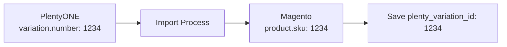
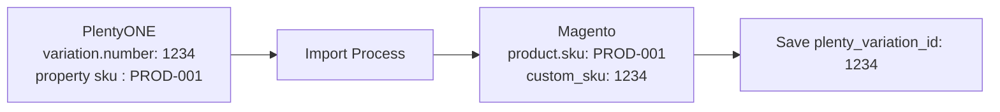

# Product Identifier Mapping

Product Identifier Mapping allows you to customize how Magento products are matched with PlentyONE variations during synchronization. This powerful feature enables flexible integration scenarios where your Magento SKUs don't match PlentyONE variation numbers.

## Overview

### Default Behavior

By default, the Mage2Plenty connector uses **SKU-based matching**:

```
PlentyONE variation.number → Magento product.sku
```

**Example:**
```php
// PlentyONE
Variation {
  number: "SHIRT-001"
}

// Magento
Product {
  sku: "SHIRT-001"
}
```

### Custom Identifier Mapping

With custom identifier mapping, you can use **any product attribute** for matching:

```
PlentyONE variation.number → Magento custom attribute (e.g., custom_sku)
PlentyONE property[sku]    → Magento product.sku
```

**Example:**
```php
// PlentyONE
Variation {
  number: "1234",
  properties: [
    { code: "sku", value: "SHIRT-001" }
  ]
}

// Magento
Product {
  sku: "SHIRT-001",
  custom_sku: "1234"
}
```

## When to Use Custom Identifier Mapping

### Common Use Cases

1. **Legacy System Migration**
   - Your Magento SKUs were established before PlentyONE integration
   - Changing SKUs would break integrations with other systems
   - Want to maintain existing SKU structure

2. **Multi-System Integration**
   - Magento SKUs must match a third-party system
   - PlentyONE uses different numbering scheme
   - Need separate identifier for matching

3. **EAN/GTIN-Based Matching**
   - Products identified by international product codes
   - EAN/GTIN stored in custom attribute
   - Want to keep readable SKUs for Magento

4. **Existing Custom Numbering**
   - Already using a custom attribute for product identification
   - Custom attribute contains PlentyONE variation numbers
   - Don't want to change existing data structure

### Example Scenarios

#### Scenario 1: Existing Magento Store

```
Situation:
- Magento store running for 5 years with established SKUs
- SKUs like: PROD-001, PROD-002, PROD-003
- PlentyONE uses variation numbers: 1234, 1235, 1236

Solution: Custom attribute mapping
- Create attribute: custom_sku
- Map variation numbers to custom_sku
- Keep existing SKUs unchanged
```

#### Scenario 2: Multi-Channel Requirements

```
Situation:
- Magento integrated with Amazon, eBay
- Marketplaces require specific SKU format
- PlentyONE uses internal numbering

Solution: Custom attribute mapping
- Store PlentyONE numbers in custom attribute
- Use marketplace-compliant SKUs in product.sku
- Maintain seamless marketplace integration
```

## Configuration

### Admin Panel Configuration

**Location:** `Stores > Configuration > PlentyONE > Item Configuration`

#### Product Mapping Identifier

**Field:** Product Mapping Identifier
**Config Path:** `plenty/item_config/product_mapping_identifier`
**Default:** `sku`
**Scope:** Global

**Options:**
- `sku` (Default) - Standard SKU-based matching
- Custom attributes (e.g., `custom_sku`, `ean`, `gtin`)

**Requirements for Custom Attributes:**
- **Scope:** Global (required)
- **Backend Type:** varchar (255 character limit)
- **Frontend Input:** text
- **Uniqueness:** Each product must have unique value
- **Data:** Must be populated before synchronization

#### SKU Fallback Mode

**Field:** SKU Fallback Mode (Custom Mapping Only)
**Config Path:** `plenty/item_config/sku_fallback_mode`
**Default:** `hard`
**Scope:** Global

:::note
This setting only applies when using custom identifier mapping (not SKU).
:::

:::tip Important: Existing Products
For **existing products** (already in Magento), the connector automatically uses the existing Magento SKU regardless of fallback mode. The SKU property in PlentyONE is **not required** for updating existing products.

The fallback mode only affects **new products** that don't exist in Magento yet.
:::

**Options:**

**Hard Fallback (Default):**
- **Existing products:** Uses existing Magento SKU (no PlentyONE SKU property needed)
- **New products:** Uses `variation.number` as SKU when PlentyONE `sku` property is missing
- Product import continues without interruption
- Best for most scenarios

**Soft Fallback (Recommended for update-only scenarios):**
- **Existing products:** Uses existing Magento SKU (no PlentyONE SKU property needed)
- **New products:** Fails import if PlentyONE `sku` property is missing
- Prevents accidental creation of products with variation.number as SKU
- Ideal when only updating existing products without creating new ones

### CLI Configuration

```bash
# Set custom mapping attribute
bin/magento config:set plenty/item_config/product_mapping_identifier custom_sku

# Set fallback mode
bin/magento config:set plenty/item_config/sku_fallback_mode hard  # or 'soft'

# Clear cache
bin/magento cache:clean config

# Verify configuration
bin/magento config:show plenty/item_config/product_mapping_identifier
# Output: custom_sku
```

## Setup Guide

### Step 1: Create Custom Attribute (if needed)

If your custom attribute doesn't exist, create it:

**Via Admin Panel:**

1. Navigate to: `Stores > Attributes > Product`
2. Click **Add New Attribute**
3. Configure:
   - **Attribute Code:** `custom_sku` (or your choice)
   - **Catalog Input Type:** Text Field
   - **Scope:** Global ⚠️ **Required**
   - **Unique Value:** Yes (Recommended)
   - **Used in Product Listing:** Yes (Optional)
   - **Visible on Storefront:** No (Usually)

**Via SQL (Advanced):**

```sql
-- Check if attribute exists
SELECT attribute_id, attribute_code, backend_type, frontend_input
FROM eav_attribute
WHERE entity_type_id = (SELECT entity_type_id FROM eav_entity_type WHERE entity_type_code = 'catalog_product')
AND attribute_code = 'custom_sku';

-- Verify attribute meets requirements
SELECT
    a.attribute_code,
    a.backend_type,
    a.frontend_input,
    a.is_required,
    a.is_unique
FROM eav_attribute a
WHERE a.attribute_code = 'custom_sku'
AND a.entity_type_id = (SELECT entity_type_id FROM eav_entity_type WHERE entity_type_code = 'catalog_product');

-- Expected output:
-- backend_type: varchar
-- frontend_input: text
```

### Step 2: Populate Custom Attribute

Before configuring mapping, ensure the attribute contains PlentyONE variation numbers:

**Option A: Manual Update (Small Catalog)**

```sql
-- Update custom attribute with variation numbers
UPDATE catalog_product_entity_varchar cpev
JOIN eav_attribute ea ON cpev.attribute_id = ea.attribute_id
JOIN catalog_product_entity cpe ON cpev.entity_id = cpe.entity_id
SET cpev.value = '1234'  -- PlentyONE variation number
WHERE ea.attribute_code = 'custom_sku'
AND cpe.sku = 'PROD-001';
```

**Option B: Import (Large Catalog)**

```csv
# products_import.csv
sku,custom_sku
PROD-001,1234
PROD-002,1235
PROD-003,1236
```

```bash
# Import via Magento
bin/magento importexport:import \
  --file=products_import.csv \
  --entity=catalog_product \
  --behavior=append
```

**Option C: Programmatic Update**

```php
use Magento\Catalog\Api\ProductRepositoryInterface;

$product = $productRepository->get('PROD-001');
$product->setData('custom_sku', '1234');
$productRepository->save($product);
```

### Step 3: Configure PlentyONE SKU Property

When using custom identifier mapping, you **must** create a PlentyONE property for SKU values.

#### In PlentyONE Admin:

1. Navigate to: **Setup → Settings → Properties → Configuration**
2. Click **Create Property** (New property button)
3. Configure:
   - **Section:** Select `Item` from dropdown ⚠️ **Required**
   - **Type:** Select `Character String` from dropdown ⚠️ **Required**
   - **Name (EN):** "Magento SKU" (or descriptive name)
   - **Property Code:** `sku` ⚠️ **Exact match, lowercase, required**
4. Save property

#### Populate SKU Property Values:

For each product variation in PlentyONE:
1. Edit item/variation
2. Find property "Magento SKU" (code: `sku`)
3. Enter the Magento SKU value
4. Save

**Example:**
```
Item: T-Shirt
├── Variation 1234 (Main)
│   ├── variation.number = "1234"
│   └── Property[code="sku"] = "PROD-001"
├── Variation 1235
│   ├── variation.number = "1235"
│   └── Property[code="sku"] = "PROD-001-RED"
```

### Step 4: Configure Mapping

**Via Admin Panel:**

1. Navigate to: `Stores > Configuration > PlentyONE > Item Configuration`
2. Find **Product Mapping Identifier** dropdown
3. Select your custom attribute (e.g., `custom_sku`)
4. Set **SKU Fallback Mode** to `hard` (recommended)
5. Click **Save Config**
6. Clear cache: `bin/magento cache:clean config`

**Via CLI:**

```bash
bin/magento config:set plenty/item_config/product_mapping_identifier custom_sku
bin/magento config:set plenty/item_config/sku_fallback_mode hard
bin/magento cache:clean config
```

### Step 5: Re-collect and Re-import

After configuration change, you must re-synchronize:

```bash
# Step 1: Re-collect items from PlentyONE API
bin/magento plenty:item:collect

# Step 2: Re-import products to establish new mappings
bin/magento plenty:item:import

# Combined command (recommended)
bin/magento plenty:item:collect && bin/magento plenty:item:import
```

:::warning Important
**Always re-collect and re-import after changing identifier mapping configuration!**
Old mappings will not work correctly without re-import.
:::

## How It Works

### Data Flow

#### Default SKU Mapping



#### Custom Attribute Mapping



### Architecture

The mapping system uses a three-layer architecture:

```php
ProductMappingConfig (Configuration)
        ↓
ProductMappingStrategy (Mapping Logic)
        ↓
SkuPool (Fast Lookups with EAV Support)
```

#### Layer 1: Configuration Service

**Interface:** `SoftCommerce\PlentyItem\Api\ProductMappingConfigInterface`
**Implementation:** `SoftCommerce\PlentyItem\Model\ProductMappingConfig`

**Methods:**
```php
// Get configured attribute code ('sku' or custom attribute)
public function getProductMappingIdentifierField(): string;

// Check if custom mapping is enabled
public function isCustomMappingEnabled(): bool;

// Get attribute ID for EAV lookups (null if using SKU)
public function getProductMappingIdentifierId(): ?int;

// Get SKU fallback mode
public function getSkuFallbackMode(): string;

// Check if soft fallback is enabled
public function isSoftFallbackEnabled(): bool;
```

#### Layer 2: Mapping Strategy

**Interface:** `SoftCommerce\PlentyItem\Api\ProductMappingStrategyInterface`
**Implementation:** `SoftCommerce\PlentyItem\Model\ProductMappingStrategy`

**Methods:**
```php
// Get product identifier (SKU or custom attribute) by variation ID
public function getProductIdentifierByVariationId(int $variationId): ?string;

// Reverse lookup: variation ID by product identifier
public function getVariationIdByProductIdentifier(string $identifier): ?int;

// Always get product SKU (regardless of mapping config)
public function getProductSkuByVariationId(int $variationId): ?string;

// Get product entity ID
public function getProductEntityIdByVariationId(int $variationId): ?int;

// Get current mapping field name
public function getProductIdentifierField(): string;

// Batch operations
public function getProductIdsByVariationIds(array $variationIds): array;
public function getProductIdsByIdentifiers(array $identifiers): array;
```

**Performance Features:**
- In-memory caching for all lookups
- Optimized SQL queries with EAV joins
- Batch operations support
- Metrics tracking (cache hits, database queries)

#### Layer 3: Data Storage

**Interface:** `SoftCommerce\PlentyItem\Api\SkuPoolInterface`
**Implementation:** `SoftCommerce\PlentyItem\Model\SkuPool`

**Features:**
- Pre-loads product data with EAV joins when custom mapping enabled
- Multiple indexes: by SKU, entity_id, variation_id, and custom identifier
- O(1) lookup performance after initialization
- Compatible with Magento Open Source (entity_id) and Adobe Commerce (row_id)

### Database Storage

Product mappings are stored in `catalog_product_entity`:

```sql
-- Schema
CREATE TABLE catalog_product_entity (
    entity_id INT,              -- Magento product ID
    sku VARCHAR(64),            -- Magento SKU
    plenty_item_id INT,         -- PlentyONE item ID
    plenty_variation_id INT,    -- PlentyONE variation ID
    -- ... other fields
);

-- Custom attributes stored in EAV tables
CREATE TABLE catalog_product_entity_varchar (
    value_id INT,
    entity_id INT,
    attribute_id INT,           -- Attribute ID for custom mapping
    value VARCHAR(255)          -- Custom identifier value
);
```

The `plenty_variation_id` field enables fast lookups regardless of configured mapping attribute.

### Synchronization Flow

#### Product Import with Custom Mapping

```
1. Collect items from PlentyONE
   └── GET /rest/items

2. For each variation:
   ├── Extract variation.number → 1234
   ├── Extract property[code="sku"] → PROD-001
   └── Check if product exists

3. Mapping Strategy determines:
   ├── Identifier field: custom_sku
   ├── Look up by: custom_sku = '1234'
   └── Product found: entity_id = 100

4. Update product:
   ├── Set sku = 'PROD-001' (from property)
   ├── Set custom_sku = '1234' (from variation.number)
   ├── Set plenty_item_id = 50
   ├── Set plenty_variation_id = 1234
   └── Update prices, stock, attributes

5. Save mapping for fast lookups
```

#### Order Import with Custom Mapping

```
1. Receive order from PlentyONE
   └── Order items contain variation_id

2. For each order item:
   ├── variation_id = 1234
   └── Lookup using ProductMappingStrategy

3. Fast lookup by plenty_variation_id:
   ├── SELECT entity_id, sku
   ├── FROM catalog_product_entity
   ├── WHERE plenty_variation_id = 1234
   └── Returns: entity_id = 100, sku = 'PROD-001'

4. Create order item:
   ├── product_id = 100
   └── sku = 'PROD-001'
```

**Performance:** O(1) lookup using indexed `plenty_variation_id` column

## Developer Guide

### Using the Configuration Service

```php
<?php
declare(strict_types=1);

namespace YourVendor\YourModule\Model;

use SoftCommerce\PlentyItem\Api\ProductMappingConfigInterface;

class YourService
{
    public function __construct(
        private readonly ProductMappingConfigInterface $productMappingConfig
    ) {}

    public function example(): void
    {
        // Get configured attribute code (returns 'sku' by default)
        $attributeCode = $this->productMappingConfig->getProductMappingIdentifierField();
        // Returns: 'sku' or 'custom_sku'

        // Check if using custom attribute (returns false if using SKU)
        $isCustom = $this->productMappingConfig->isCustomMappingEnabled();
        // Returns: true if using custom attribute

        // Get attribute ID for EAV lookups (null if using SKU)
        $attributeId = $this->productMappingConfig->getProductMappingIdentifierId();
        // Returns: 173 (EAV attribute ID) or null

        // Check fallback mode
        $fallbackMode = $this->productMappingConfig->getSkuFallbackMode();
        // Returns: 'hard' or 'soft'

        $isSoftFallback = $this->productMappingConfig->isSoftFallbackEnabled();
        // Returns: true if soft fallback enabled

        // Use in your logic
        if ($isCustom) {
            // Handle custom attribute mapping
            $this->handleCustomMapping($attributeCode, $attributeId);
        } else {
            // Handle standard SKU mapping
            $this->handleSkuMapping();
        }
    }
}
```

### Using the Mapping Strategy

```php
<?php
declare(strict_types=1);

namespace YourVendor\YourModule\Model;

use SoftCommerce\PlentyItem\Api\ProductMappingStrategyInterface;

class OrderImportService
{
    public function __construct(
        private readonly ProductMappingStrategyInterface $mappingStrategy
    ) {}

    public function importOrder(array $orderData): void
    {
        foreach ($orderData['items'] as $item) {
            $variationId = $item['variation_id'];

            // Get product identifier (respects configuration)
            $identifier = $this->mappingStrategy->getProductIdentifierByVariationId($variationId);
            // Returns: 'PROD-001' or '1234' depending on configuration

            // Always get SKU (regardless of configuration)
            $sku = $this->mappingStrategy->getProductSkuByVariationId($variationId);
            // Returns: 'PROD-001' (always the actual Magento SKU)

            // Get product entity ID
            $productId = $this->mappingStrategy->getProductEntityIdByVariationId($variationId);
            // Returns: 100

            // Reverse lookup
            $foundVariationId = $this->mappingStrategy->getVariationIdByProductIdentifier($identifier);
            // Returns: 1234

            // Check what field is being used
            $field = $this->mappingStrategy->getProductIdentifierField();
            // Returns: 'sku' or 'custom_sku'
        }
    }

    public function batchProcess(array $variationIds): void
    {
        // Batch operations for better performance
        $productIds = $this->mappingStrategy->getProductIdsByVariationIds($variationIds);
        // Returns: [100, 101, 102]

        // Or by identifiers
        $identifiers = ['PROD-001', 'PROD-002', 'PROD-003'];
        $productIds = $this->mappingStrategy->getProductIdsByIdentifiers($identifiers);
        // Returns: [100, 101, 102]
    }
}
```

### Using the Data Pool

```php
<?php
declare(strict_types=1);

namespace YourVendor\YourModule\Model;

use SoftCommerce\PlentyItem\Api\SkuPoolInterface;

class ProductImportService
{
    public function __construct(
        private readonly SkuPoolInterface $skuPool
    ) {}

    public function import(array $variations): void
    {
        // Initialize pool once (loads all products with EAV data if needed)
        $this->skuPool->initialize();

        foreach ($variations as $variation) {
            $variationNumber = $variation['number']; // This is variation.number

            if ($this->skuPool->isCustomMappingEnabled()) {
                // Lookup by custom identifier
                $productData = $this->skuPool->getDataByIdentifier($variationNumber);
                // Returns: ['entity_id' => 100, 'sku' => 'PROD-001', 'identifier' => '1234']

                // Get SKU from custom identifier
                $sku = $this->skuPool->getSkuByIdentifier($variationNumber);
                // Returns: 'PROD-001'
            } else {
                // Default: lookup by SKU
                $productData = $this->skuPool->getDataBySku($variationNumber);
                // Returns: ['entity_id' => 100, 'sku' => 'PROD-001']
            }

            // Other lookups
            $dataByEntityId = $this->skuPool->getDataByEntityId(100);
            $dataByVariationId = $this->skuPool->getDataByVariationId(1234);

            // Process product update...
        }

        // Clear when done
        $this->skuPool->clear();
    }
}
```

## CLI Convenience Commands

The Mage2Plenty connector provides convenient CLI commands for managing and verifying product-to-item mappings.

### Show Product Mapping

Display detailed mapping information for specific products:

**Command:** `plenty:item:map:show`

**Usage:**
```bash
# Show mapping for single product by SKU
bin/magento plenty:item:map:show --sku="PROD-001"

# Show mapping for single product by ID
bin/magento plenty:item:map:show --product-id=42

# Show mapping for multiple products (comma-separated)
bin/magento plenty:item:map:show -s "PROD-001,PROD-002,PROD-003"
bin/magento plenty:item:map:show -p "42,43,44"
```

**Output Example:**
```
Product Mapping Information
━━━━━━━━━━━━━━━━━━━━━━━━━━━━━━━━━━━━━━━━━━━━━━━━━━━━━━━━━━━━━━━━━━━━━━━━━━━━

Product Information:
SKU             PROD-001
Product ID      100
Link Field ID   100
Product Name    Example Product
Type            simple
Status          Enabled

Mapping Configuration:
Mapping Mode              Custom Attribute
Identifier Field          custom_sku
Custom Attribute Value    1234
SKU Source               PlentyONE Property

PlentyONE Mapping:
Item ID                  50
Item Type               default
Item Status             ✓ Collected
Variation ID            1234
Variation Number        1234
Is Main Variation       Yes
Variation Active        Yes
Variation Status        ✓ Collected
Last Synced            2025-01-15 10:30:00

━━━━━━━━━━━━━━━━━━━━━━━━━━━━━━━━━━━━━━━━━━━━━━━━━━━━━━━━━━━━━━━━━━━━━━━━━━━━
Summary: 1 product(s) displayed, 0 not mapped
```

**Features:**
- Shows product information (SKU, ID, name, type, status)
- Displays mapping configuration (mode, identifier field, custom attribute value)
- Shows PlentyONE mapping (item ID, variation ID, status)
- Validates mapping and shows warnings
- Supports batch operations with multiple products

**Validation Warnings:**

The command detects common mapping issues:
- Missing custom attribute values
- Incomplete mappings (item ID without variation ID)
- Uncollected PlentyONE data

### Map Products to Items

Create or update product-to-item mappings:

**Command:** `plenty:item:map`

**Usage:**
```bash
# Map specific products by ID
bin/magento plenty:item:map --id=100

# Map multiple products (comma-separated)
bin/magento plenty:item:map -i "100,101,102"

# Map all unmapped products
bin/magento plenty:item:map

# Preview mapping without making changes (dry-run)
bin/magento plenty:item:map --dry-run
bin/magento plenty:item:map --id=100 -d
```

**How It Works:**

1. **Loads Products:** Fetches products from Magento based on filters
2. **Matches Variations:** Uses configured identifier field to match with PlentyONE variations
3. **Creates Mappings:** Updates `plenty_item_id` and `plenty_variation_id` in `catalog_product_entity`
4. **Respects Configuration:** Uses SKU or custom attribute based on your settings

**Mapping Logic:**

The command respects your product identifier configuration:

**SKU Mapping (Default):**
```sql
-- Matches variation.number with product.sku
SELECT pve.parent_id as item_id, pve.entity_id as variation_id
FROM plenty_variation_entity pve
JOIN catalog_product_entity cpe ON pve.number = cpe.sku
```

**Custom Attribute Mapping:**
```sql
-- Matches variation.number with custom attribute
SELECT pve.parent_id as item_id, pve.entity_id as variation_id
FROM plenty_variation_entity pve
JOIN catalog_product_entity_varchar cpev ON pve.number = cpev.value
JOIN catalog_product_entity cpe ON cpev.entity_id = cpe.entity_id
WHERE cpev.attribute_id = [custom_attribute_id]
```

**Output Example:**
```bash
$ bin/magento plenty:item:map --id=100,101,102

Starting product mapping for 3 products...

 3/3 [============================] 100% 2 secs/2 secs 10.0 MiB

MAPPING SUMMARY:
  - Successfully mapped: 2 products
  - Already mapped (skipped): 1 products
```

**Dry-Run Mode:**
```bash
$ bin/magento plenty:item:map --id=100 --dry-run

DRY RUN MODE: Previewing 1 product mappings...

 1/1 [============================] 100% < 1 sec/< 1 sec 10.0 MiB

DRY RUN SUMMARY:
  - Would map: 1 products
  - Already mapped (would skip): 0 products

No changes were made to the database.
```

**Safety Features:**
- **Confirmation prompt** when mapping all products (no ID filter)
- **Dry-run mode** to preview changes
- **Batch processing** (50 products per batch)
- **Progress bar** for visual feedback
- **Error handling** with detailed messages

**Use Cases:**

1. **Initial Setup:**
   ```bash
   # After configuring custom identifier mapping, map all products
   bin/magento plenty:item:map --dry-run  # Preview first
   bin/magento plenty:item:map             # Execute
   ```

2. **Fixing Unmapped Products:**
   ```bash
   # Show which products need mapping
   bin/magento plenty:item:map:show --sku="PROD-001"

   # Map the product
   bin/magento plenty:item:map --id=100
   ```

3. **After Configuration Change:**
   ```bash
   # Re-collect PlentyONE data
   bin/magento plenty:item:collect

   # Re-map all products with new configuration
   bin/magento plenty:item:map
   ```

4. **Testing Custom Attribute Mapping:**
   ```bash
   # Test with single product first
   bin/magento plenty:item:map --id=100 --dry-run
   bin/magento plenty:item:map:show --product-id=100
   ```

### Workflow Example

Complete workflow for setting up and verifying custom identifier mapping:

```bash
# 1. Configure custom identifier mapping
bin/magento config:set plenty/item_config/product_mapping_identifier custom_sku
bin/magento cache:clean config

# 2. Collect PlentyONE data (if not already collected)
bin/magento plenty:item:collect

# 3. Preview mapping
bin/magento plenty:item:map --dry-run

# 4. Map products
bin/magento plenty:item:map

# 5. Verify mapping for specific products
bin/magento plenty:item:map:show --sku="PROD-001,PROD-002"

# 6. Check for any unmapped products
bin/magento plenty:item:map:show --product-id=100
```

## Verification & Testing

### Verify Configuration

```bash
# Check current mapping configuration
bin/magento config:show plenty/item_config/product_mapping_identifier

# Check fallback mode
bin/magento config:show plenty/item_config/sku_fallback_mode

# Check if custom attribute exists and meets requirements
mysql -e "
SELECT
    a.attribute_id,
    a.attribute_code,
    a.backend_type,
    a.frontend_input,
    a.is_required,
    a.is_unique
FROM eav_attribute a
WHERE a.attribute_code = 'custom_sku'
AND a.entity_type_id = (
    SELECT entity_type_id
    FROM eav_entity_type
    WHERE entity_type_code = 'catalog_product'
);
"
```

### Verify Data Population

```sql
-- Check how many products have the custom attribute populated
SELECT COUNT(DISTINCT cpev.entity_id) as products_with_attribute
FROM catalog_product_entity_varchar cpev
JOIN eav_attribute ea ON cpev.attribute_id = ea.attribute_id
WHERE ea.attribute_code = 'custom_sku'
AND cpev.value IS NOT NULL
AND cpev.value != '';

-- View sample data
SELECT
    cpe.entity_id,
    cpe.sku,
    cpev.value as custom_sku,
    cpe.plenty_variation_id
FROM catalog_product_entity cpe
LEFT JOIN catalog_product_entity_varchar cpev ON cpe.entity_id = cpev.entity_id
LEFT JOIN eav_attribute ea ON cpev.attribute_id = ea.attribute_id
    AND ea.attribute_code = 'custom_sku'
WHERE cpe.plenty_variation_id IS NOT NULL
LIMIT 10;
```

### Test Import

```bash
# Test with single product first
bin/magento plenty:item:collect --item-id=50 --verbose

# Check collected data
mysql -e "SELECT * FROM plenty_item_entity WHERE entity_id = 50;"
mysql -e "SELECT * FROM plenty_item_variation WHERE item_id = 50;"
mysql -e "SELECT * FROM plenty_property WHERE parent_id IN (
    SELECT entity_id FROM plenty_item_variation WHERE item_id = 50
) AND attribute_code = 'sku';"

# Import the product
bin/magento plenty:item:import --item-id=50 --verbose

# Verify mapping
mysql -e "
SELECT
    cpe.entity_id,
    cpe.sku,
    cpev.value as custom_sku,
    cpe.plenty_item_id,
    cpe.plenty_variation_id
FROM catalog_product_entity cpe
LEFT JOIN catalog_product_entity_varchar cpev ON cpe.entity_id = cpev.entity_id
LEFT JOIN eav_attribute ea ON cpev.attribute_id = ea.attribute_id
    AND ea.attribute_code = 'custom_sku'
WHERE cpe.plenty_item_id = 50;
"
```

### Test Order Import

```bash
# Import test order
bin/magento plenty:order:import --order-id=1001 --verbose

# Check logs for any "product not found" errors
tail -f var/log/plenty/order.log
```

### Test Stock Sync

```bash
# Sync stock
bin/magento plenty:stock:import --verbose

# Verify stock updated correctly
mysql -e "
SELECT
    cpe.entity_id,
    cpe.sku,
    cpev.value as custom_sku,
    csi.qty
FROM catalog_product_entity cpe
LEFT JOIN catalog_product_entity_varchar cpev ON cpe.entity_id = cpev.entity_id
LEFT JOIN eav_attribute ea ON cpev.attribute_id = ea.attribute_id
    AND ea.attribute_code = 'custom_sku'
JOIN cataloginventory_stock_item csi ON cpe.entity_id = csi.product_id
WHERE cpe.plenty_variation_id IS NOT NULL
LIMIT 10;
"
```

## Troubleshooting

### Issue: Attribute Not Appearing in Dropdown

**Symptoms:**
- Custom attribute not visible in admin dropdown
- Dropdown only shows "sku" option

**Causes:**
1. Attribute `scope` is not `global` (e.g., it's `website` or `store`)
2. Attribute `backend_type` is not `varchar` (e.g., it's `text`, `int`)
3. Attribute `frontend_input` is not `text` (e.g., it's `textarea`, `select`)

**Solution:**

```sql
-- Check attribute configuration
SELECT
    a.attribute_code,
    a.backend_type,
    a.frontend_input,
    a.is_global
FROM eav_attribute a
WHERE a.attribute_code = 'custom_sku'
AND a.entity_type_id = (
    SELECT entity_type_id
    FROM eav_entity_type
    WHERE entity_type_code = 'catalog_product'
);

-- is_global should be 1 (SCOPE_GLOBAL)
-- backend_type should be 'varchar'
-- frontend_input should be 'text'
```

Create a new attribute with correct settings:
1. Navigate to: `Stores > Attributes > Product`
2. Create with:
   - **Scope:** Global
   - **Catalog Input Type:** Text Field (creates varchar/text)

### Issue: Products Not Matching After Configuration Change

**Symptoms:**
- Products not found during import
- Orders fail with "product not found" errors
- Stock updates fail

**Root Cause:** Old mappings still reference SKU

**Solution:**

```bash
# Step 1: Re-collect items from PlentyONE
bin/magento plenty:item:collect

# Step 2: Re-run full product import
bin/magento plenty:item:import

# Or combined:
bin/magento plenty:item:collect && bin/magento plenty:item:import
```

**Verification:**

```sql
-- Check if products have the custom attribute populated
SELECT
    entity_id,
    sku,
    plenty_variation_id,
    (SELECT value FROM catalog_product_entity_varchar cpev
     JOIN eav_attribute ea ON cpev.attribute_id = ea.attribute_id
     WHERE cpev.entity_id = cpe.entity_id
     AND ea.attribute_code = 'custom_sku'
     LIMIT 1) as custom_sku
FROM catalog_product_entity cpe
WHERE plenty_variation_id IS NOT NULL
LIMIT 10;

-- Check mapping status
SELECT
    COUNT(*) as total_products,
    COUNT(plenty_variation_id) as mapped_products
FROM catalog_product_entity;
```

### Issue: Missing SKU During Import (Custom Mapping)

**Symptoms:**
- Import fails with error: `SKU property is required for new products`
- Products have custom attribute but no SKU

**Important:** This error only occurs for **new products** that don't exist in Magento. For existing products, the connector automatically uses the existing Magento SKU.

**Root Cause:**
- Product doesn't exist in Magento yet (new product)
- PlentyONE property with code `sku` is not configured or has empty values

**Solutions:**

**Option A: For Update-Only Scenarios (Recommended)**

If you're only updating existing products and don't need to create new ones:

1. Ensure products already exist in Magento with the custom attribute populated
2. Use **Soft Fallback** mode - existing products will use their Magento SKU automatically
3. New products will fail (preventing accidental creation with wrong SKUs)

```bash
bin/magento config:set plenty/item_config/sku_fallback_mode soft
bin/magento cache:clean config
```

**Option B: Create SKU Property in PlentyONE (For New Products)**

If you need to create new products:

1. Navigate to: **Setup → Settings → Properties → Configuration**
2. Click **Create Property**
3. Configure new property:
   - **Section:** Select `Item` from dropdown
   - **Type:** Select `Character String` from dropdown
   - **Name (EN):** "Magento SKU"
   - **Property Code:** `sku` (exact match, lowercase)
4. Populate SKU values for new variations
5. Re-collect and import:

```bash
bin/magento plenty:item:collect
bin/magento plenty:item:import
```

**Option C: Use Hard Fallback (Creates SKU from Variation Number)**

If you want new products to be created with variation.number as SKU:

```bash
bin/magento config:set plenty/item_config/sku_fallback_mode hard
bin/magento cache:clean config
```

**Verification:**

```bash
# Check if SKU property is collected
mysql -e "
SELECT
    v.item_id,
    v.entity_id as variation_id,
    v.variation_number,
    p.property_code,
    p.value_string
FROM plenty_item_variation v
LEFT JOIN plenty_property p ON v.entity_id = p.parent_id
WHERE p.property_code = 'sku'
LIMIT 5;
"
```

### Issue: Configuration Change Not Taking Effect

**Symptoms:**
- Changed configuration but system still uses old attribute

**Cause:** Cache not cleared

**Solution:**

```bash
bin/magento cache:clean config
bin/magento cache:flush

# Verify cache cleared
bin/magento cache:status
```

### Issue: Import Validation Errors

**Error:** `Custom mapping attribute "custom_sku" value exceeded maximum allowed length`

**Cause:** Variation number exceeds 255 characters (varchar limit)

**Solution:**
1. Ensure variation numbers are under 255 characters
2. Or create attribute with `text` backend type (unlimited length)
   - Note: Text backend not supported by default dropdown
   - Would require custom source model

**Error:** `Required attributes are missing. [sku, custom_sku]`

**Cause:** Either SKU or custom attribute is missing during import

**Solution:**
1. Ensure PlentyONE property with code `sku` exists
2. Ensure custom attribute is populated in Magento
3. Run re-collect to fetch property data

## Best Practices

### 1. Test on Staging First

Always test configuration changes on staging environment:

```bash
# Staging environment
bin/magento config:set plenty/item_config/product_mapping_identifier custom_sku
bin/magento plenty:item:collect --item-id=TEST_ITEM_ID
bin/magento plenty:item:import --item-id=TEST_ITEM_ID
# Verify results before production
```

### 2. Backup Before Changes

Create database backup before changing mapping configuration:

```bash
# Backup database
mysqldump -u user -p database_name > backup_before_mapping_change.sql

# Backup specific tables
mysqldump -u user -p database_name \
  catalog_product_entity \
  catalog_product_entity_varchar \
  plenty_item_entity \
  > backup_product_tables.sql
```

### 3. Verify Data Quality

Ensure custom attribute values are unique and match PlentyONE exactly:

```sql
-- Check for duplicates
SELECT value, COUNT(*) as count
FROM catalog_product_entity_varchar cpev
JOIN eav_attribute ea ON cpev.attribute_id = ea.attribute_id
WHERE ea.attribute_code = 'custom_sku'
GROUP BY value
HAVING count > 1;

-- Check for empty values
SELECT cpe.entity_id, cpe.sku
FROM catalog_product_entity cpe
LEFT JOIN catalog_product_entity_varchar cpev ON cpe.entity_id = cpev.entity_id
LEFT JOIN eav_attribute ea ON cpev.attribute_id = ea.attribute_id
    AND ea.attribute_code = 'custom_sku'
WHERE cpev.value IS NULL OR cpev.value = '';
```

### 4. Monitor After Change

Watch logs closely after changing mapping attribute:

```bash
# Monitor import logs
tail -f var/log/plenty/item.log

# Monitor order import logs
tail -f var/log/plenty/order.log

# Monitor system logs
tail -f var/log/system.log
```

### 5. Document Your Configuration

Keep internal documentation of which attribute is used:

```markdown
# Project Configuration

## Product Identifier Mapping
- **Attribute:** custom_sku
- **Reason:** Legacy system compatibility
- **Configured:** 2025-01-15
- **By:** John Doe

## PlentyONE Property
- **Property Name:** Magento SKU
- **Property Code:** sku
- **Property ID:** 104
```

### 6. Use Hard Fallback (Default)

Unless you have specific requirements, use hard fallback mode:

```bash
bin/magento config:set plenty/item_config/sku_fallback_mode hard
```

This prevents import failures due to missing SKU property while still logging warnings.

## Migration Guide

### Migrating from SKU to Custom Attribute

**Scenario:** You've been using SKU mapping and want to switch to custom attribute mapping.

**Steps:**

1. **Prepare Custom Attribute:**
   ```bash
   # Create attribute if needed
   # Populate with current SKU values or PlentyONE variation numbers
   ```

2. **Configure PlentyONE:**
   ```
   # Create property with code 'sku'
   # Populate with desired Magento SKU values
   ```

3. **Test on Single Product:**
   ```bash
   # Configure mapping
   bin/magento config:set plenty/item_config/product_mapping_identifier custom_sku

   # Test with one product
   bin/magento plenty:item:collect --item-id=TEST_ID
   bin/magento plenty:item:import --item-id=TEST_ID

   # Verify result
   ```

4. **Full Migration:**
   ```bash
   # Re-collect all items
   bin/magento plenty:item:collect

   # Re-import all products
   bin/magento plenty:item:import

   # Verify mappings
   ```

5. **Test All Processes:**
   ```bash
   # Test order import
   bin/magento plenty:order:import

   # Test stock sync
   bin/magento plenty:stock:import
   ```

### Migrating from Custom Attribute to SKU

**Scenario:** You want to return to standard SKU mapping.

**Steps:**

1. **Verify Data:**
   ```sql
   -- Ensure SKUs match variation numbers or update them
   SELECT cpe.sku, cpev.value as custom_sku
   FROM catalog_product_entity cpe
   JOIN catalog_product_entity_varchar cpev ON cpe.entity_id = cpev.entity_id
   JOIN eav_attribute ea ON cpev.attribute_id = ea.attribute_id
   WHERE ea.attribute_code = 'custom_sku'
   AND cpe.sku != cpev.value;
   ```

2. **Update SKUs if Needed:**
   ```sql
   -- Update SKUs to match variation numbers
   UPDATE catalog_product_entity cpe
   JOIN catalog_product_entity_varchar cpev ON cpe.entity_id = cpev.entity_id
   JOIN eav_attribute ea ON cpev.attribute_id = ea.attribute_id
   WHERE ea.attribute_code = 'custom_sku'
   SET cpe.sku = cpev.value;
   ```

3. **Change Configuration:**
   ```bash
   bin/magento config:set plenty/item_config/product_mapping_identifier sku
   bin/magento cache:clean config
   ```

4. **Re-import:**
   ```bash
   bin/magento plenty:item:collect
   bin/magento plenty:item:import
   ```

## Related Documentation

- **[Attribute Mapping](/docs/mapping/attributes)** - General attribute mapping configuration
- **[Product Types](/docs/mapping/product-attributes)** - Complex product type mapping
- **[Product Import Profile](/docs/profiles/product-import)** - Configure item synchronization profiles
- **[Order Import Profile](/docs/profiles/order-import)** - Configure order import with custom mapping
- **[Stock Import Profile](/docs/profiles/stock-import)** - Configure stock sync with custom mapping
- **[Troubleshooting](/docs/troubleshooting/common-issues)** - Common integration issues

## Summary

Product Identifier Mapping provides flexible product matching between Magento and PlentyONE:

✅ **Benefits:**
- Maintain existing SKU structure
- Support legacy system integration
- Enable multi-system compatibility
- Use EAN/GTIN for matching

⚙️ **Configuration:**
- Simple admin panel setup
- CLI configuration available
- Global scope requirement
- Fallback mode for missing SKUs

🔄 **Process:**
1. Create/verify custom attribute
2. Populate attribute data
3. Configure PlentyONE SKU property
4. Set mapping configuration
5. Re-collect and re-import

🚀 **Performance:**
- O(1) lookups after initial mapping
- In-memory caching
- Optimized EAV queries
- Batch operations support

🔍 **Testing:**
- Test on single product first
- Verify all synchronization processes
- Monitor logs for errors
- Validate data quality

Follow this guide to implement custom product identifier mapping successfully and maintain seamless integration between Magento and PlentyONE.