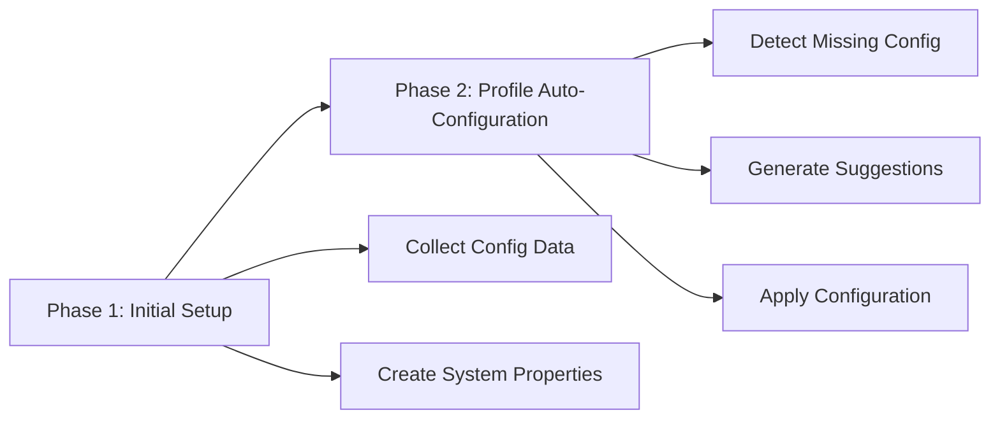

# Profile Setup & Auto-Configuration

Mage2Plenty includes an intelligent setup system that automates much of the initial configuration process. This guide covers both the initial system setup and the profile auto-configuration features.

## Overview

The setup process consists of two main phases:



## Phase 1: Initial Setup

Before creating profiles, you must run the initial setup to collect configuration data from PlentyONE and create necessary system properties.

### Complete Setup (Recommended)

Run the complete setup wizard which handles both collection and creation:

```bash
bin/magento plenty:setup:init
```

This command will:
1. ✅ Collect configuration data from PlentyONE API
2. ✅ Create system properties in PlentyONE
3. ✅ Prepare the system for profile creation

**Expected output:**
```
╔══════════════════════════════════════════╗
║     Mage2Plenty Complete Setup Wizard    ║
╚══════════════════════════════════════════╝

Running complete setup for all modules...

══════════════════════════════════════════════
Phase 1: Collecting Configuration Data
══════════════════════════════════════════════

✓ Collecting referrers...
✓ Collecting shipping countries...
✓ Collecting shipping profiles...
✓ Collecting VAT configurations...
✓ Collecting web stores...
✓ Collecting warehouse configurations...

══════════════════════════════════════════════
Phase 2: Creating System Properties
══════════════════════════════════════════════

✓ Creating default referrer (magento)...
✓ Creating media type referrers...
✓ Creating order properties...
✓ Creating customer properties...
✓ Creating item properties...

✓ Complete setup finished successfully!

Next Steps:
1. Navigate to Admin → Plenty Profiles
2. Create profiles for each module (Import/Export)
3. Configure mappings in each profile
4. Test with sample data before full synchronization
```

### Selective Module Setup

If you only need specific modules:

```bash
# Setup only order module
bin/magento plenty:setup:init --modules=order

# Setup multiple modules
bin/magento plenty:setup:init --modules=customer,item,order,stock
```

### Dry Run Preview

See what will be created without making changes:

```bash
bin/magento plenty:setup:init --dry-run
```

### Individual Phase Commands

Run phases separately if needed:

#### Step 1: Collect Configuration Data

```bash
# Collect all configuration data
bin/magento plenty:setup:collect

# Collect specific types
bin/magento plenty:setup:collect --type=referrer,shipping,vat

# List available collectors
bin/magento plenty:setup:collect --list
```

**What Gets Collected:**
- Referrers (order sources)
- Shipping countries and profiles
- VAT configurations
- Web stores and locations
- Item availabilities, barcodes, units
- Customer classes
- Warehouse configurations

#### Step 2: Create System Properties

```bash
# Create all system properties
bin/magento plenty:setup:create

# Create specific properties
bin/magento plenty:setup:create --type=referrer,order

# List available property managers
bin/magento plenty:setup:create --list

# Verbose output
bin/magento plenty:setup:create --verbose
```

**What Gets Created in PlentyONE:**
- Default referrer (`magento`)
- Media type referrers (image, small_image, thumbnail, etc.)
- Order properties
- Customer properties
- Item property groups
- Attribute set properties

### Domain-Specific Setup Commands

Each module provides its own granular setup commands:

#### Order Module

```bash
# Collect order configuration data
bin/magento plenty:order:setup:collect

# Create order properties
bin/magento plenty:order:setup:property

# Complete order setup
bin/magento plenty:order:setup:init
```

#### Item Module

```bash
# Collect item configuration data
bin/magento plenty:item:setup:collect

# Create item properties
bin/magento plenty:item:setup:property

# Complete item setup
bin/magento plenty:item:setup:init
```

#### Customer Module

```bash
# Collect customer configuration
bin/magento plenty:customer:setup:collect

# Create customer properties
bin/magento plenty:customer:setup:property

# Complete customer setup
bin/magento plenty:customer:setup:init
```

#### Stock Module

```bash
# Collect stock/warehouse configuration
bin/magento plenty:stock:setup:collect
```

## Phase 2: Profile Auto-Configuration

After initial setup, Mage2Plenty can automatically configure profiles when you create them.

### How Auto-Configuration Works

1. **Create a new profile** in Admin
2. **System detects** missing configurations
3. **Modal appears** with intelligent suggestions
4. **Review and accept** suggestions
5. **System applies** configuration automatically

### Auto-Configuration Features

#### 1. Client Detection

For single-client systems (most common), the client ID is auto-selected:

```
✓ Client ID: Automatically detected (12345)
```

#### 2. Store Mapping

System suggests store-to-locale mappings based on your Magento store configuration:

```
Suggested Store Mappings:
• Default Store View → PlentyONE Locale: English (ID: 1)
• German Store → PlentyONE Locale: German (ID: 2)
• French Store → PlentyONE Locale: French (ID: 3)
```

#### 3. Category Mapping

For category profiles, suggests root category mappings:

```
Root Category Mapping:
• Magento Root (ID: 2) → PlentyONE Category (ID: 1)
```

#### 4. Attribute Mapping Templates

Provides default attribute mapping templates:

```json
{
  "name": "name",
  "description": "description",
  "short_description": "shortDescription",
  "price": "prices",
  "special_price": "salesPrices"
}
```

### Using Auto-Configuration

#### Via Admin Panel

1. **Navigate to:** SoftCommerce → Plenty Profiles
2. **Click:** Add New Profile
3. **Select:** Profile Type (e.g., "Item Import")
4. **Click:** Save

If profile is unconfigured, a modal will appear:

```
╔════════════════════════════════════════════╗
║  Profile Auto-Configuration Available      ║
╠════════════════════════════════════════════╣
║                                            ║
║  Missing Configurations Detected:          ║
║  • Client ID                               ║
║  • Store Mapping                           ║
║  • Attribute Mapping                       ║
║                                            ║
║  Would you like to apply suggested         ║
║  configurations?                           ║
║                                            ║
║  [Review Suggestions]  [Apply All]  [Skip] ║
╚════════════════════════════════════════════╝
```

#### Review Suggestions

Click **Review Suggestions** to see detailed configuration suggestions:

```
Client Configuration:
  ✓ Client ID: 12345 (auto-detected)
  Confidence: High

Store Mapping:
  ✓ Default Store → Locale 1 (English)
  ✓ German Store → Locale 2 (German)
  Confidence: High

Attribute Mapping:
  • Default template provided
  • Can be customized after applying
  Confidence: Medium
```

#### Apply Configuration

Click **Apply All** to accept suggestions. The system will:

1. Save configuration to database
2. Clear relevant caches
3. Mark profile as configured
4. Redirect to profile edit page for fine-tuning

### Shared Configuration Between Profiles

Related profiles (Import/Export pairs) can share common configurations:

```
Import Profile (plenty_item_import) configures:
  • Client ID
  • Store Mapping

Export Profile (plenty_item_export) can inherit:
  ✓ Client ID (shared)
  ✓ Store Mapping (shared)
  + Additional export-specific settings
```

**Common Shared Configurations:**
- `client_config/client_id`
- `store_config/store_mapping`
- `category_config/root_category_mapping`

## Manual Profile Configuration

If you prefer manual configuration or need to customize:

### 1. Create Profile

```bash
# Profiles are typically created via Admin UI
# Navigate to: SoftCommerce → Plenty Profiles → Add New
```

### 2. Configure Basic Settings

**Required fields:**
- **Profile Name:** e.g., "Item Import - Main Store"
- **Type ID:** e.g., `plenty_item_import`
- **Status:** Active
- **Store:** Select applicable store

### 3. Configure Module-Specific Settings

#### Client Configuration

```
Client Configuration Tab:
├─ Client ID: [Auto-detected or select]
└─ Connection: Test connection
```

#### Store Configuration

```
Store Configuration Tab:
├─ Store Mapping:
│  ├─ Default Store → Locale 1
│  ├─ German Store → Locale 2
│  └─ French Store → Locale 3
└─ Web Store: Select PlentyONE web store
```

#### Category Configuration (for category profiles)

```
Category Configuration Tab:
├─ Root Category Mapping:
│  └─ Magento Root → PlentyONE Category
├─ Category Attribute Mapping:
│  ├─ Name → name
│  ├─ Description → description
│  └─ Meta Title → metaTitle
└─ Category Tree Sync: Enable
```

#### Item Configuration (for product profiles)

```
Item Configuration Tab:
├─ Attribute Mapping: [Configure attribute mappings]
├─ Price Configuration: [Configure price types]
├─ Stock Configuration: [Configure stock sources]
└─ Image Configuration: [Configure image roles]
```

#### Order Configuration (for order profiles)

```
Order Configuration Tab:
├─ Status Mapping:
│  ├─ Pending → [PlentyONE Status]
│  ├─ Processing → [PlentyONE Status]
│  └─ Complete → [PlentyONE Status]
├─ Payment Method Mapping
├─ Shipping Method Mapping
└─ Order Referrer: Select referrer
```

## Configuration Storage

Configurations are stored in the `softcommerce_profile_config` table:

```sql
-- View profile configuration
SELECT profile_id, path, value
FROM softcommerce_profile_config
WHERE profile_id = 1;

-- Example output:
-- profile_id | path                                          | value
-- 1          | plenty_item_import/client_config/client_id   | 12345
-- 1          | plenty_item_import/store_config/store_mapping| {"1":"1","2":"2"}
```

## Verifying Setup

### Check Initial Setup Status

```bash
# Verify system properties exist in PlentyONE
bin/magento plenty:system:check

# Check collected configuration data
mysql> SELECT * FROM plenty_client_config;
```

### Verify Profile Configuration

```bash
# Export profile configuration
bin/magento profile:export:config --profile=<profile_id>

# Check configuration completeness
# Admin → Plenty Profiles → [Profile] → Configuration Status
```

### Test Profile Execution

```bash
# Test with single entity
bin/magento plenty:item:import --sku=TEST-SKU --profile=1 --verbose
```

## Troubleshooting Setup

### Issue: "System properties already exist"

**Meaning:** Properties were created in a previous setup

**Action:** This is informational, not an error. Proceed with profile creation.

### Issue: "Configuration collector failed"

**Common causes:**
- API connection issues
- Insufficient API permissions
- PlentyONE system unavailable

**Solution:**
```bash
# Test connection
bin/magento plenty:client:test

# Retry collection with verbose output
bin/magento plenty:setup:collect --verbose

# Check API logs
tail -f var/log/plenty_api_error.log
```

### Issue: "Auto-configuration modal not appearing"

**Causes:**
- Profile already configured
- Browser cache issue
- JavaScript error

**Solution:**
1. Clear browser cache (Ctrl+Shift+R)
2. Check browser console for errors
3. Clear Magento cache: `bin/magento cache:flush`
4. Manually configure via profile edit page

### Issue: "Property creation failed"

**Common errors:**
- **"Property already exists"** - Property exists, can be ignored
- **"Insufficient permissions"** - API user lacks property creation rights
- **"Invalid property data"** - Check property configuration

**Solution:**
```bash
# Check existing properties in PlentyONE
# Setup → Item → Properties

# Retry with specific type
bin/magento plenty:setup:create --type=order --verbose
```

## Setup Best Practices

1. **Run Complete Setup First**
   ```bash
   bin/magento plenty:setup:init
   ```
   Don't skip this step!

2. **One Module at a Time**
   If troubleshooting, set up modules individually:
   ```bash
   bin/magento plenty:setup:init --modules=order
   ```

3. **Document Custom Configurations**
   If you customize auto-configuration suggestions, document why

4. **Test in Staging**
   Run complete setup in staging environment first

5. **Export Configuration**
   After setup, export configuration for backup:
   ```bash
   bin/magento profile:export:config --profile=all > profiles_backup.json
   ```

6. **Version Control**
   Keep profile configurations in version control for team collaboration

## Advanced Configuration

### Extending Auto-Configuration

To add auto-configuration for custom profile types:

#### 1. Create Configuration Detector

```php
// YourModule/Model/AutoConfig/YourProfileConfigurationDetector.php
class YourProfileConfigurationDetector implements ProfileConfigurationDetectorInterface
{
    public function isProfileConfigured(int $profileId): bool
    {
        // Check if required configurations exist
        return $this->hasClientConfig($profileId)
            && $this->hasStoreMapping($profileId)
            && $this->hasCustomMapping($profileId);
    }

    public function getMissingConfigurations(int $profileId): array
    {
        // Return array of missing config paths
    }

    public function getProfileType(): string
    {
        return 'your_custom_type';
    }
}
```

#### 2. Create Auto-Config Service

```php
// YourModule/Model/AutoConfig/YourProfileAutoConfig.php
class YourProfileAutoConfig
{
    public function generateSuggestions(int $profileId): array
    {
        return [
            'client_id' => $this->detectClientId(),
            'store_mapping' => $this->suggestStoreMapping(),
            'custom_config' => $this->generateCustomConfig()
        ];
    }
}
```

#### 3. Register in DI

```xml
<!-- etc/di.xml -->
<type name="SoftCommerce\PlentyProfile\Model\AutoConfig\ConfigurationDetectorPool">
    <arguments>
        <argument name="detectors" xsi:type="array">
            <item name="your_type" xsi:type="object">YourModule\Model\AutoConfig\YourProfileConfigurationDetector</item>
        </argument>
    </arguments>
</type>
```

## Next Steps

After completing setup and profile configuration:

1. **[Test First Sync](/docs/testing/first-sync)** - Perform initial synchronization test
2. **[Configure Scheduling](/docs/profiles/scheduling)** - Automate profile execution
3. **[Set Up Monitoring](/docs/monitoring/profiles)** - Track profile performance

## Related Documentation

- **[Profile Creation](/docs/profiles/create-profile)** - Manual profile creation
- **[CLI Commands](/docs/cli-commands)** - Complete CLI reference
- **[System Requirements](/docs/system-requirements)** - Prerequisites

---

**Important:** Always run `bin/magento plenty:setup:init` before creating your first profile. This ensures all necessary system properties and configurations are in place.