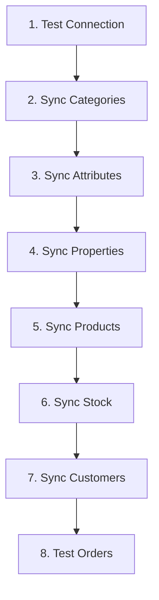

# First Synchronization Test

After completing the initial setup and configuration, it's time to test your first data synchronization. This guide walks you through a safe, step-by-step approach to verify everything is working correctly.

## Pre-Flight Checklist

Before starting your first sync, verify:

- [ ] ✅ **System check passed:** `bin/magento plenty:system:check`
- [ ] ✅ **Connection verified:** `bin/magento plenty:client:test`
- [ ] ✅ **Initial setup completed:** `bin/magento plenty:setup:init`
- [ ] ✅ **Profiles created:** All required profiles are configured
- [ ] ✅ **Mappings configured:** Status, attributes, payment, shipping mappings set

## Recommended Sync Order

Follow this sequence for a smooth first synchronization:



## Step 1: Verify Connection

Start with a connection test to ensure everything is accessible:

```bash
bin/magento plenty:system:check
```

**Expected output:**
```
✓ All checks passed!
✓ Connection test successful! Found 2 webstore(s).
```

If this fails, see [Connection Testing](/docs/testing/connection-test) before proceeding.

## Step 2: First Category Sync

Categories should be synchronized first as products depend on them.

### Export Categories (Magento → PlentyONE)

```bash
# Collect categories (required before export)
bin/magento plenty:category:collect --verbose

# Export categories
bin/magento plenty:category:export --verbose
```

### Import Categories (PlentyONE → Magento)

```bash
# Collect categories from PlentyONE
bin/magento plenty:category:collect --verbose

# Import collected categories
bin/magento plenty:category:import --verbose
```

### Verify Categories

**In Magento Admin:**
- Navigate to **Catalog → Categories**
- Verify categories appear with correct names
- Check category hierarchy is preserved

**In PlentyONE:**
- Navigate to **Item → Categories**
- Verify categories appear with correct names
- Check category hierarchy is preserved

## Step 3: Attribute Synchronization

Sync attributes before products to ensure all product attributes are mapped.

### Collect and Export Attributes

```bash
# Collect attribute data (required before export)
bin/magento plenty:attribute:collect --verbose

# Export product attributes
bin/magento plenty:attribute:export --verbose

# Export manufacturers (brands)
bin/magento plenty:attribute:export-manufacturer --verbose
```

### Verify Attributes

Check in PlentyONE:
- **Setup → Item → Attributes**
- Verify attribute names and options match Magento

## Step 4: Property Synchronization

Sync properties after attributes to ensure proper product configuration.

### Collect and Sync Properties

```bash
# Collect properties from PlentyONE
bin/magento plenty:property:collect --verbose

# Export properties to PlentyONE
bin/magento plenty:property:export --verbose

# Import properties from PlentyONE
bin/magento plenty:property:import --verbose
```

### Verify Properties

Check in PlentyONE:
- **Setup → Item → Properties**
- Verify properties are correctly mapped

## Step 5: First Product Sync (Start Small!)

:::warning Important
Start with a SMALL number of products (1-5) for your first test. This allows you to:
- Identify issues quickly
- Understand the sync process
- Verify mappings are correct
:::

### Test with Single Product

```bash
# Collect items (required before import/export)
bin/magento plenty:item:collect --verbose

# Export single product by SKU
bin/magento plenty:item:export --sku=TEST-SKU-001 --verbose
```

### What to Monitor

Watch for these in the output:

```
✓ Product exported successfully
  ├─ Base product: ID 12345
  ├─ Attributes mapped: 15/15
  ├─ Categories: 2 assigned
  ├─ Images: 3 uploaded
  ├─ Prices: Default, Tier
  └─ Stock: Updated
```

### Verify in PlentyONE

1. **Navigate to:** Item → Item overview
2. **Search for:** The product SKU
3. **Check:**
   - ✅ Product title and description
   - ✅ Attributes and variants
   - ✅ Categories assigned
   - ✅ Images uploaded
   - ✅ Prices are correct
   - ✅ Stock quantity matches

### Test Product Import

```bash
# Collect products from PlentyONE
bin/magento plenty:item:collect --date-updated="$(date +%Y-%m-%d)" --verbose

# Import specific product by PlentyONE item ID
bin/magento plenty:item:import -i 100 --verbose

# Or import all collected products
bin/magento plenty:item:import --verbose
```

### Expand Gradually

Once single product works:

```bash
# Export 5 products
bin/magento plenty:item:export --sku=SKU1,SKU2,SKU3,SKU4,SKU5

# Export specific category
bin/magento plenty:item:export --category=10

# Export by date (products updated today)
bin/magento plenty:item:export --date-updated="$(date +%Y-%m-%d)"
```

## Step 6: Stock Synchronization

After products are synced, test inventory updates.

### Import Stock (PlentyONE → Magento)

```bash
# Collect stock from PlentyONE
bin/magento plenty:stock:collect --verbose

# Import stock updates
bin/magento plenty:stock:import --verbose
```

### Verify Stock Levels

**Check product saleable quantity:**
```bash
# Check saleable quantity for product
bin/magento plenty:stock:get_saleable_qty --sku=TEST-SKU-001
```

**Verify in Magento Admin:**
- Navigate to **Catalog → Products**
- Open product and check **Quantity** field
- For MSI: Check **Sources** section for stock levels per source

### Stock Update Flow Test

1. **Change quantity in PlentyONE**
2. **Collect and import:**
   ```bash
   bin/magento plenty:stock:collect
   bin/magento plenty:stock:import
   ```
3. **Verify change reflected in Magento**

## Step 7: Customer Synchronization (Optional)

If you need customer data synced:

### Export Customers (Magento → PlentyONE)

```bash
# Export single customer for testing
bin/magento plenty:customer:export --id=<customer_id> --verbose
```

### Import Customers (PlentyONE → Magento)

```bash
# Collect contacts
bin/magento plenty:contact:collect --verbose

# Collect addresses
bin/magento plenty:address:collect --verbose

# Import collected data
bin/magento plenty:customer:import --verbose
```

## Step 8: Test Order Export

:::tip Best Practice
Use a **test order** for your first order export. Don't use a real customer order until you've verified the process works correctly.
:::

### Create Test Order

1. **In Magento:** Create an order via admin (Customers → All Customers → Create Order)
2. **Use test data:**
   - Test customer email
   - Simple product (already synced)
   - Test payment method (mapped in profile)

### Export Test Order

```bash
# Export by order increment ID (order number)
bin/magento plenty:order:export --increment_id=000000123 --verbose

# Or export by entity ID
bin/magento plenty:order:export -i 100 --verbose
```

### Verify Order in PlentyONE

Check **Orders → Order UI**:
- ✅ Order appears with correct details
- ✅ Customer contact created/linked
- ✅ Addresses are correct
- ✅ Line items match
- ✅ Payment information present
- ✅ Shipping method correct

### Test Order Status Update

1. **In PlentyONE:** Change order status (e.g., to "Shipped")
2. **Collect and import:**
   ```bash
   bin/magento plenty:order:collect --date-updated="$(date +%Y-%m-%d)"
   bin/magento plenty:order:import
   ```
3. **Verify in Magento:** Order status updated

## Common First-Sync Issues

### Issue: "Client ID not configured"

**Solution:**
```bash
# Run client wizard to configure connection
bin/magento plenty:setup:client

# Or set manually
bin/magento config:set plenty/client_config/client_id <your_client_id>
```

### Issue: "Missing required mapping"

**Cause:** Profile mappings not configured

**Solution:**
1. Go to **Byte8 → Profiles → Manage Profiles → [Profile] → Configuration**
2. Complete all required mapping sections
3. Save and retry

### Issue: Product export fails with "Category not found"

**Solution:**
```bash
# Export categories first
bin/magento plenty:category:export

# Then retry product export
bin/magento plenty:item:export --sku=TEST-SKU-001
```

### Issue: Images not uploading

**Common causes:**
- Image files too large (>5MB)
- Invalid image format
- Permissions issue

**Solution:**
```bash
# Check file permissions
chmod 644 pub/media/catalog/product/*/*.jpg

# Check image format (must be JPG, PNG, GIF)
file pub/media/catalog/product/path/to/image.jpg

# Resize large images
mogrify -resize 2000x2000\> pub/media/catalog/product/*/*.jpg
```

## Monitoring Your First Sync

### Watch Log Files

Open multiple terminal windows to monitor logs in real-time:

```bash
# Terminal 1: API logs
tail -f var/log/plenty_api.log

# Terminal 2: Error logs
tail -f var/log/plenty_error.log

# Terminal 3: Profile-specific logs
tail -f var/log/plenty_item.log
```

### Check Sync Progress

```bash
# Check queue status (if using async processing)
bin/magento queue:consumers:list

# Check queue messages
mysql> SELECT * FROM queue_message WHERE status='in_progress' LIMIT 10;
```

## Performance Baseline

Record these metrics during your first sync for future comparison:

| Operation | Expected Time | Your Time |
|-----------|---------------|-----------|
| Single product export | < 5 seconds | _____ |
| 10 products export | < 30 seconds | _____ |
| Category sync | < 10 seconds | _____ |
| Stock update (100 items) | < 1 minute | _____ |
| Order export | < 5 seconds | _____ |

## Success Checklist

Your first sync is successful when:

- [  ] ✅ Categories appear in both systems
- [ ] ✅ Test products synchronized correctly
- [ ] ✅ All product attributes mapped properly
- [ ] ✅ Images uploaded successfully
- [ ] ✅ Stock levels accurate
- [ ] ✅ Test order exported without errors
- [ ] ✅ Order status updates flow correctly
- [ ] ✅ No critical errors in logs

## Next Steps

Once your first sync is successful:

1. **Gradual Expansion**
   ```bash
   # Increase product count gradually
   bin/magento plenty:item:export --category=10
   ```

2. **Enable Automation**
   - Set up cron jobs for scheduled syncs
   - Configure queue consumers for async processing
   - See: [Profile Scheduling](/docs/profiles/scheduling)

3. **Monitor and Optimize**
   - Review sync performance
   - Adjust batch sizes if needed
   - See: [Performance Monitoring](/docs/monitoring/profiles)

4. **Go Live**
   - Perform full catalog sync
   - Enable real-time order export
   - Monitor closely for first few days

## Testing Checklist Template

Use this checklist for your first sync:

```markdown
## First Sync Test - [Date]

### Pre-Flight
- [ ] System check passed
- [ ] Connection verified
- [ ] Profiles configured
- [ ] Mappings complete

### Category Sync
- [ ] Export: ___ categories
- [ ] Import: ___ categories
- [ ] Verified in PlentyONE

### Product Sync
- [ ] Single product test: SKU ________
- [ ] 5 products test: Success/Fail
- [ ] Images uploaded: Yes/No
- [ ] Attributes correct: Yes/No

### Stock Sync
- [ ] Collected stock data
- [ ] Imported to Magento
- [ ] Quantities match

### Order Test
- [ ] Test order created: #________
- [ ] Exported successfully
- [ ] Verified in PlentyONE
- [ ] Status update tested

### Issues Encountered
1. ________________________________
2. ________________________________

### Performance Notes
- Product export time: _____ seconds
- Order export time: _____ seconds

### Next Steps
- [ ] Expand to more products
- [ ] Enable cron automation
- [ ] Monitor for 24 hours
```

## Related Documentation

- **[Connection Testing](/docs/testing/connection-test)** - Verify API connectivity
- **[Order Synchronization](/docs/testing/order-synchronization)** - Detailed order testing
- **[Profile Configuration](/docs/profiles/create-profile)** - Configure sync profiles
- **[Troubleshooting](/docs/troubleshooting/common-issues)** - Common problems

---

**Pro Tip:** Document your first sync process! Take screenshots, note timings, and record any issues. This documentation will be invaluable when troubleshooting future issues or training team members.